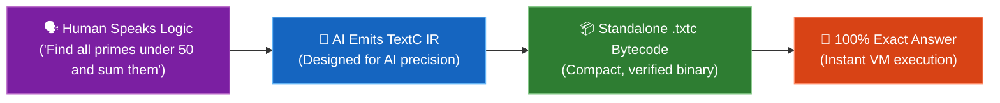

# ✨ textc (text-compiler)

<div align="center">

[](https://www.npmjs.com/package/text-compiler)
[](https://opensource.org/licenses/MIT)
[](#-built-for-logical--mathematical-algorithms-only)
[](#-engineered-specifically-for-ai)

### **The AI-Native Compiler for Mathematical & Logical Algorithms.**
**Speak your algorithm in plain English &bull; Compiled via AI-native IR &bull; Executed with 100% mathematical precision.**

---

</div>

## 🎯 Built for Logical & Mathematical Algorithms Only

> **Important by Design:** `textc` is **not** a general-purpose programming language for building websites, UI, or mobile apps.

`textc` is a specialized, laser-focused algorithm compiler designed exclusively for:
- 🔢 **Mathematical calculations & sequences** (Fibonacci, Collatz, factorials, GCD/LCM, powers, geometry).
- 📊 **Data analytics & statistics** (averages, medians, standard deviations, filtering, finding extremes).
- 🔄 **Array transformations & sorting** (in-place sorting, reversing, slicing, partitioning, swapping).
- 🧩 **Logical problem solving & puzzles** (graph/path steps, conditionals, counting problems, simulation loops).

---

## 🤖 Engineered Specifically for AI

Traditional programming languages are designed for humans to type manually. `textc`’s Intermediate Representation (IR) is **designed specifically for AI models**:

- 🧠 **Zero Ambiguity:** Strict, unambiguous grammar that eliminates AI syntax confusion and hallucinated keywords.
- 🔒 **Explicit Mutability (`let` vs `mut`):** Enforces clear distinction between constants and changing state so AI-generated algorithms never corrupt memory.
- ⚡ **Pure Determinism:** Translates fuzzy, probabilistic human language into exact, deterministic machine bytecode (`.txtc`).



---

## 🚀 Quick Install

### 🐧 Linux, 🍏 macOS & 📱 Android Termux
```bash
curl -fsSL https://raw.githubusercontent.com/sapirrior/textc/main/installer/install.sh | bash
```

### 🪟 Windows (PowerShell)
```powershell
irm https://raw.githubusercontent.com/sapirrior/textc/main/installer/install.ps1 | iex
```

### 📦 Via npm
```bash
npm install -g text-compiler
```

---

## 🌈 Write Algorithms in ANY Natural Text

`textc` understands your logic in whatever format feels natural:

### 1️⃣ Conversational Data Analysis
**`scores.txt`:**
```text
I have test scores: [88, 92, 79, 95, 61, 84].
Sort them, remove the single lowest score, and calculate the average of the remaining ones.
Print the final average.
```
```bash
textc scores.txt --run
```
```
84
```

---

### 2️⃣ Step-by-Step Simulation & Finance Logic
**`investment.txt`:**
```text
1. Start with 1000 dollars.
2. For 5 years in a row:
   - Grow the balance by 8% each year.
   - Add a 200 dollar bonus at the end of each year.
3. Print the final balance.
```
```bash
textc investment.txt --run
```
```
2637
```

---

### 3️⃣ Mathematical Sequences & Iteration
**`collatz.txt`:**
```text
Start with the number 27.
If it is even, cut it in half.
If it is odd, multiply by 3 and add 1.
Repeat until you reach 1, and count how many steps it took.
Print the total step count.
```
```bash
textc collatz.txt --run
```
```
111
```

---

### 4️⃣ Data Extremes & Comparison
**`inventory.txt`:**
```text
Prices: [45, 12, 89, 23, 67, 105, 34]
Find the cheapest item and the most expensive item.
Print the difference between the most expensive and cheapest items.
```
```bash
textc inventory.txt --run
```
```
93
```

---

### 5️⃣ Word & Symmetry Logic
**`palindrome.txt`:**
```text
Given word letters: ["r", "a", "c", "e", "c", "a", "r"]
Reverse the letters and check if it spells the same word forwards and backwards.
Print true if it's a palindrome, false otherwise.
```
```bash
textc palindrome.txt --run
```
```
true
```

---

## ⚡ Why textc?

- 🗣️ **No Programming Knowledge Needed:** Just express your logical thought or math problem.
- 🎯 **100% Deterministic:** Mathematical precision with no hallucinated math.
- ⚡ **Lightning Fast:** Precompiled `.txtc` program files execute in under 1 millisecond.
- 📦 **Standalone Binaries:** Compile once and run offline anywhere with zero external dependencies.
- 🛡️ **Guaranteed Safe:** Automatic bounds checking, safe math, and memory protection built into the VM.

---

## ⚙️ Configuration

Set your AI credentials once:
```bash
export TEXTC_BASE_URL="https://api.openai.com/v1"
export TEXTC_API_KEY="your-api-key"
export TEXTC_MODEL_NAME="gpt-4o-mini"
```

---

## 🛠️ Handy Commands

```bash
# Compile and run your plain-text file in one go:
textc my_algorithm.txt --run

# Compile your natural text into a shareable .txtc bytecode binary:
textc my_algorithm.txt

# Run a saved .txtc binary instantly (offline, 0 tokens, 0ms):
textc my_algorithm.txtc

# View the AI-native Intermediate Representation (IR):
textc my_algorithm.txt --emit-ir
```

---

## 📜 License

Distributed under the [MIT License](LICENSE). Built for the future of AI-driven algorithmic computing.
